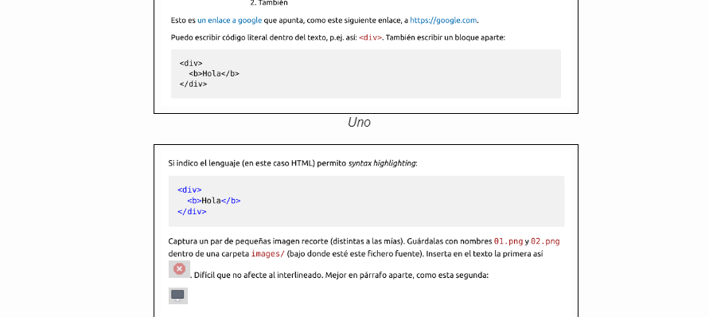

# Mi título (cc-by Miguel Ángel Guaita Villaseñor)

Usamos heading1 para el título del documento (generará un h1). Sustituye arriba
tu Nombre y Apellido (mayúsculas iniciales). Puedo usar énfasis *ligero*
(cursiva) o **fuerte** (negrita). Incluso usar **una *anidación* de ambos.** O
también *anidarlos de esta **otra** manera.*

Esto es un 2º párrafo. <br>Y voy a la línea sin crear un 3º. Este fichero se
tiene que llamar "test.md", con extensión ".md".  

# Parte 1

Usamos heading2 para cabeceras de 1er nivel.  

## Parte 1.1

Y así succesivamente.  

## Parte 1.2

Hacemos listas anidadas, ordenadas o no:

* Frutas (sustituye por tus 3 favoritas, en orden, ¡y no te copies!)  

1. Melocotón  
2. Manzana
3. Arándanos

* Respuestas  
  * Sí  
  * No  
  * Puede  
    1. Que sí  
    2. Que no  
        1. O bien  
        2. También

Esto es [un enlace a google](https://google.com) que apunta, como este siguiente
enlace, a <https://google.com>. <br>Puedo escribir código literal dentro del
texto, p.ej. así: `<div>`. También escribir un bloque aparte:

```
<div>
    <b>Hola\<b>
<div>
```

Si indico el lenguaje (en este caso HTML) permito *syntax highlighting*:  

```html
<div>
    <b>Hola<b>
<div>
```

Captura un par de pequeñas imagen recorte (distintas a las mías). Guárdalas con
nombres [01.png](images/01.png) y [02.png](images/02.png) dentro de una carpeta
[images](/images/) (bajo donde esté este fichero fuente). Inserta en el texto la
primera así. Difícil que no afecte al interlineado.
Mejor en párrafo aparte, como esta segunda:  

Esas imágenes:

* Tienen título "¡Pillado!" (aparece al hacerles hover).

* Tienen texto alternativo "Recorte 1" y "Recorte 2" (respectivamente).
  Comprueba que aparece, renombrando provisionalmente una de ellas en tu ".md"
  para que no la encuentre.  

Para citas breves "puedes usar comillas dentro de tu texto". Si son más largas,
se hace en párrafo aparte, al estilo "e-mail":  
> En un lugar de la Mancha, puedo poner *énfasis* dentro la **cita.**
>
>Y otro párrafo.  
Con cambio de línea dentro.  
>
>* O incluso listas.
>   1. Anidadas  
>
>>Y aquí hay una doble cita.
>>
>>De dos párrafos.
>
Hay otras cosas que no son compatibles con CommonMark. Por ejemplo VSCode
soporta nativamente usar `--tachar--` para ~~tachar~~ y hacer tablas con este
código (pon dos personajes/películas de tu elección):

```
| Personaje | Película |
| --------- | -------- |
| Peter     | Spiderman|
| Bilbo     | El Hobbit|  
```

Que da:
| Personaje | Película |
| --------- | -------- |
| Peter     | Spiderman|
| Bilbo     | El Hobbit|  

Para quedar compatible con CommonMark, se puede utilizar HTML puro, por ejemplo
`<s>tachar</s>` para ~~tachar~~. Aunque las tablas en HTML puro duelen bastante
más.

Podemos usar HTML puro también para cosas como superíndices (3<sup>2</sup> = 9)
o subíndices (H<sub>2</sub>O). Otros flavors permiten lograr eso mismo con
marcas así: `3^2^ = 9` y `H-2-O`.

Si uso extensiones no-CommonMark:  

* Queda más conciso (y claro), y no presupone que se quiere tener HTML como
  salida (salida potencialmente universal).
* Pero esto será incompatible potencialmente con muchos otros parseadores de
  markdown.

¡Es una elección!
